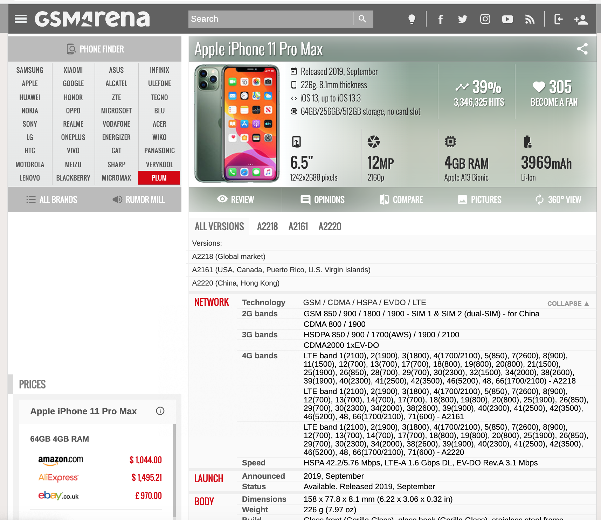
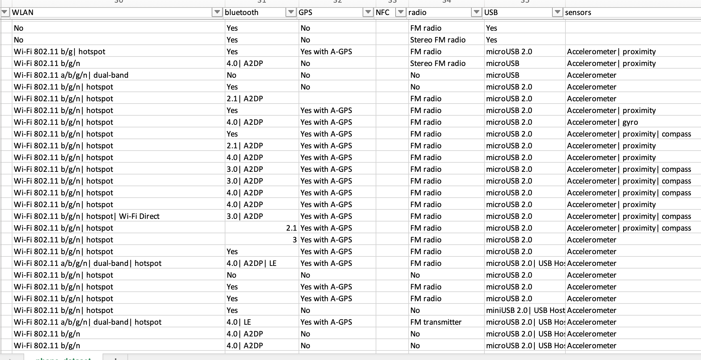
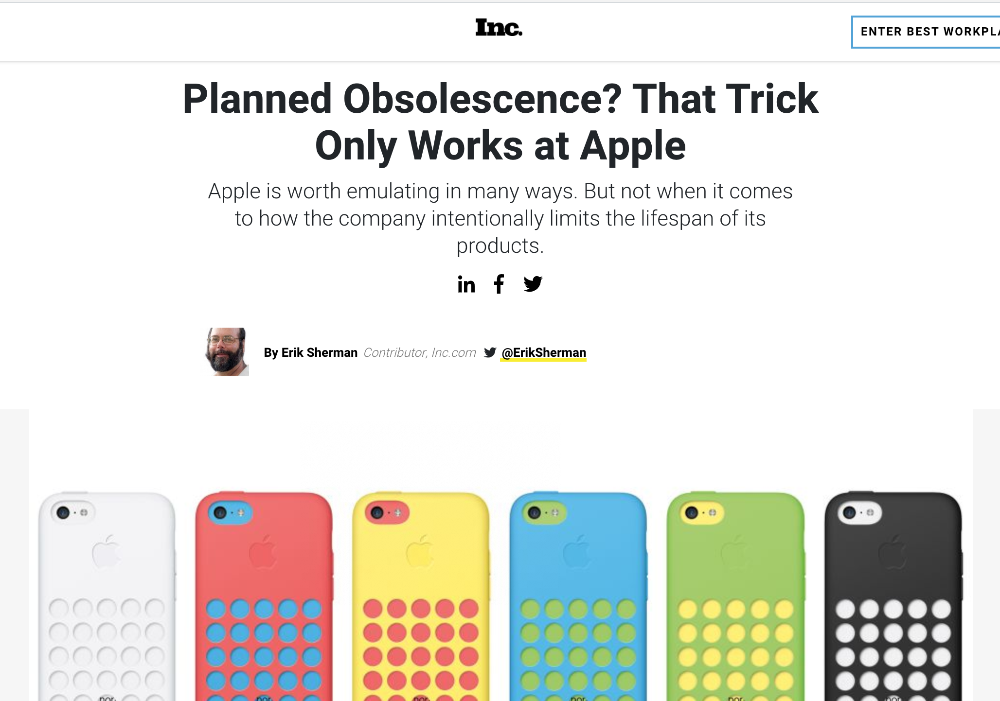
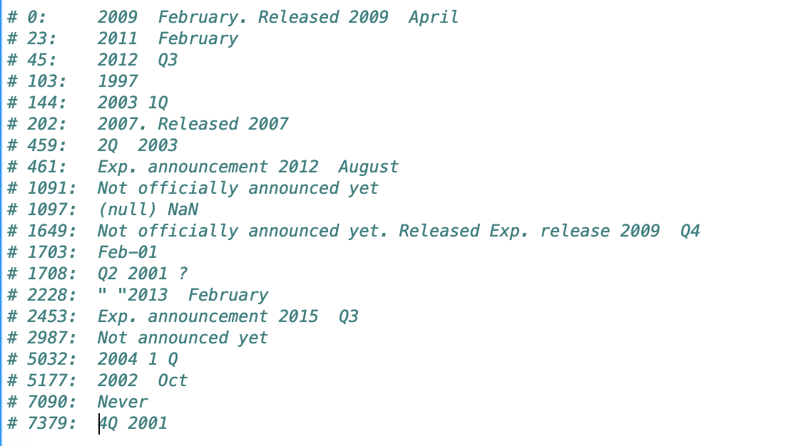
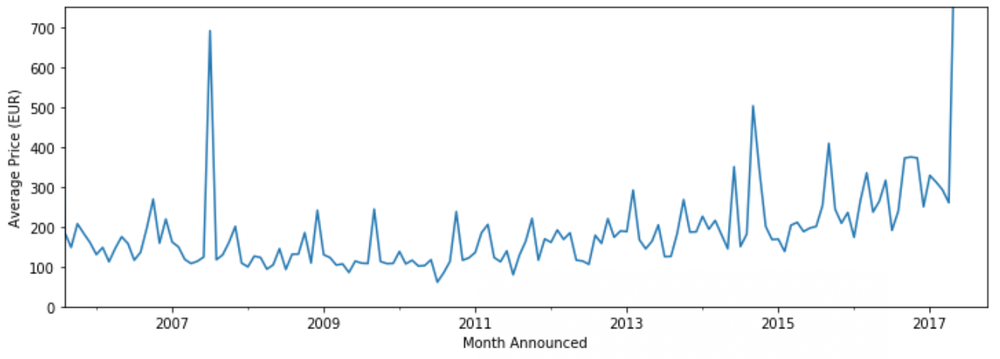
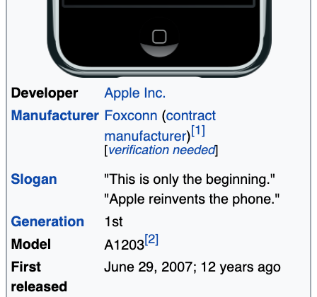

# Title: Rotten Apple?

## Intro
* Let's Talk Everyone's favorite vices, our cellphones
* In tech hardware, there is a notion of designed (or planned) obsilense
* One of the worst offenders of this is thought to be Apple. 
    * I wanted see if there is data to prove this

## The Data
* I found a dataset on kaggle of 8632 Mobile Devices
    * 108 unique manufactures, from 1994 to June 2017
* The dataset has 40 attribute columns, with many containing imbedded informaiton
* This comes a Kaggle contributor named Arwin Neil Baichoo
* The scrapper program he used was written in C# and nearly 950 lines of code
* Scraped from a website called GSMArena which tracks release and hardware specifications for personal devices

* Since it was webscrabed, a big challenge for me was cleaning
* Mostly hardware features, so software features like multitasking or video camera were not available

## My Hunch
* That Apple waits to release features significantly later than competitors
    * If you are able to roll more features into a new device, people are insentivezed to upgrade
    * In hardware, this is important to sustain cash flows

## Cleaning
* Since it was webscraped, there was bound to be some errors.
* Arwin did a lot of this for me, but different formating, extraneous words, NaNs still persisted
    * Particularily import was cleaning the dates
        * I found 20 different date formats the month released
        

* Thought it would also be important to extract feature data in a repeatable manor
    * Hoped to create a Class to parse out feature data for specified feature

## EDA
* CLEAN, BREAK IT, CLEAN, BREAK IT...
* Find General Trends over time
    * Price Increase?
    * Screen Size Increase?
    * Battery Capacity Increase?
* Number of phone models
* Observe when features first appear and are generally adopted by the market
    * Determine when Apple introduced products
* Explore differneces between US, Chinese, Korean and European manufactures

## Analysis
* Infer what general trends mean
    For Example - Average Price of Device

* Make specific note of when Apple first introduced a feature

* Conduct tests to determine whether Apple Significantly 

## Future Abitions
* Implement Arwin's Webscraper Algorythm in C# or Python
    * Practice Webscrapping
    * Hopefully make new data CLEANER
* Gather data between 2017-Present
* Has the 'game' changed??  -Designed Obsilesence by removing features first?

